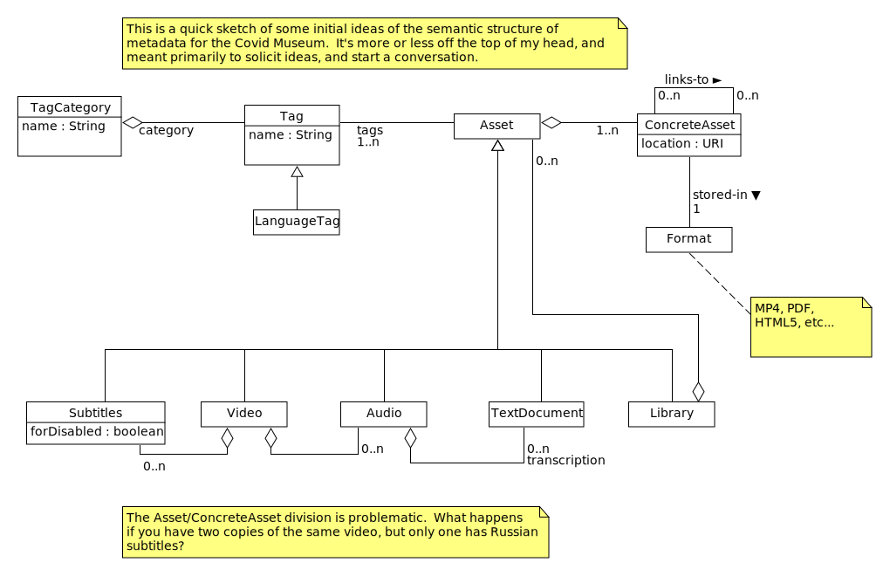

# Asset Metadata

## Introduction
This is a quick sketch of some initial ideas of the semantic structure of
metadata for the Covid Museum.  It's more or less off the top of my head, and
meant primarily to solicit ideas, and start a conversation.

## Scope

This is meant as a semantic model; no particular realization is presumed

## Diagram

## Discussion

This model is making some assertions, in the spirit of throwing ideas
against the wall to see what sticks.  Some notable assertions:

*  The languages in which an asset are available will be described
   using the generic tagging facility, but a language tag is important
   enough and different enough to be called out as its own subtype of
   tag.  Languages could be captured outside the generic tagging mechanism,
   too -- is there a known best practice here that should be followed?

*  The same asset can be stored multiple times, in different formats.  This
   is captured as "ConcreteAsset," which is a terrible name.  Maybe
   "AssetRealization" would be accurate, but it's a bit heavy.  "AssetVersion"
   would be bad, since "version" means something different.

*  Videos have subtitles, which aren't the same thing as a text document.
   Subtitles have two distinct roles:  Subtitles for the disabled (which
   is the UK English term, they're called "closed captions" in US English
   for regulatory reasons), and subtitles that are there for foreign language
   speakers.

*  Audio can have a transcription, which is meaningful enough in its own right
   to be thought of as its own text document.

*  In this document there's no notion of external asset.  A text document
   could be a bibliography, of course.

*  It's assumed that the asset payload is stored elsewhere, and for the
   purposes of the metadata system, it is a lump of bytes.  Data mining
   of the asset payload is not considered here, except to the extent that
   a metadata structure helps locate assets to mine, and inform the process.

*  The URI of an asset might resolve to multiple URLs.

